<!-- =========================
     rumeysatr / Profile README
     ========================= -->

  <!-- Capsule header (remote SVG) -->
  

  <!-- Typing SVG -->
  

  <!-- Quick badges -->
  
  
  

---

## 👋 About Me
- 🎓 **42 Kocaeli** core eğitimini tamamladım; şimdi daha çok **uzmanlaşma projeleri** ve gerçek dünya sistemleri üzerinde ilerliyorum.
- 🔧 Private olsa da aktif olarak **DevOps/Platform** projeleri yapıyorum: containerization, monitoring/logging, CI/CD ve otomasyon.
- 🧠 “Engineering mindset”: ölç, görünür kıl, otomatikleştir.

---

## 🧰 Tech Stack (signal, not noise)

  

---

## 📊 GitHub Dashboard

<!-- Two-column layout using HTML table (GitHub-safe) -->
<table>
  <tr>
    <td valign="top" width="50%">

### 🔥 Streak

### ⭐ Core Stats

    </td>
    <td valign="top" width="50%">

### 🧠 Languages (public)

### 🧩 Deep Metrics (auto-generated)
<!-- This file is generated by .github/workflows/metrics.yml -->

    </td>
  </tr>
</table>

---
<h2>📊 GitHub Analitiği</h2>

  
  

  

<h2>🧬 Öne Çıkan Projeler & Mimari Çalışmalar</h2>

| Proje | Rol & Teknoloji | Durum |
| :--- | :--- | :--- |
| **ft_transcendence** | **Full Stack & DevOps** TypeScript, NestJS, Docker, Microservices, Blockchain | 🚀 *Tamamlandı (42 Kocaeli)* Frontend ve DevOps süreçlerini yönettim. |
| **Split Bill App** | **Mobile Developer** Flutter, OCR, Offline-First Architecture | 📱 *Geliştirme Aşamasında* Fiş tarama özellikli hesap bölüştürme uygulaması. |
| **Speech-to-Text** | **Backend Developer** Go (Golang), Gemini API | 🎙️ *Prototip* Yapay zeka destekli ses işleme servisi. |
| **Online Exam System** | **Full Stack** Python (Flask), React, PostgreSQL | 🎓 *Tamamlandı* Okul projesi için geliştirilen kapsamlı sınav sistemi. |
| **Private DevOps Tools** | **DevOps Engineer** Ansible, Terraform, CI/CD | 🔒 *Gizli* Kurumsal otomasyon ve altyapı projeleri. |

<h2>🐍 Katkı Ekosistemi</h2>

  

  

